# 02-11-2021 Divide and Conquer

---

Class: #algo 
[Slides](https://moodle.colgate.edu/mod/folder/view.php?id=481635)
Reviewed: #📌  at second tree example end
Week: #week/week-3 
Tags: 
#lecture #algo/recursion #algo/logarithms 

---

## Divide and Conquer Runtime
Generally, the runtime required to divide and conquer consists of three parts:
1. Time to break the problem into sub-problems 
2. Time to recursively solve the sub problems
3. Time to combine the answers

⭐**Steps 1 and 3 happen at each level of recursion**


**✏ Ex:**  Compute $b^x$:
1. Divide: compute $b^x$
2. Recurse: call `pow(b, x/2)`
3. Combine: square $b^{x/2}$ (and if $b$ is odd multiply by $b$ again)

$\begin{align} 
T(x)&= \text{divide + recurse + combine} \\
&= O(1) + T(\frac{x}{2}) + O(1)\\
\end{align}$

 <br/>

###### Generalized RT of Divide and Conquer:

$T(n) = [$num of sub-problems$] * T([$size of sub-problems$]) + [$time to divide + combine + do other work on that level$]$

 <br/>

### Runtime Analysis Strategies:

---

#### Strategy 1: Solving the Recurrence Relation 
==Solving a recurrence relation==: Finding a closed-form expression that doesn't involve recursive calls to that function

**Steps:**
1. Find a generalized pattern of the recurrence rel. in terms of its depth/level, $k$
2. Use the base case (determined if necessary) to find the **depth of the expression at the base case** ($k$) in terms of the input size ($n$ or $x$)
3. Plug the base case in terms of $n$ back into the generalized expression and simplify

---

#### Strategy 2: Tree
The runtime is:
$\text{height/depth of the tree}*\text{work done per level of the tree}$

**Steps:**
1. **Determine the height of the tree:** The depth is how many recursive calls can be made before reaching the base case. 
	Steps:
	- Determine the base case $b$
	- Depth can usually be found by solving for $k$ using the base case and what $n$ is being divided by in the situation described in [[Algorithmic Runtime#Logarithms introduction|logarithms introducction]]. Usually $\log_b n$ where $b$ is what the input is being divided by and $n$ is the input

2. **Determine work per level:** Given by $\text{nodes per level}*\text{work per node}$
	You can draw out the tree for the recurrence where each node contains the fraction of the original input that is passed if it is helpful to visualize. 
	- **Nodes per level:** the number of recursive calls made each level (What $T(n)$ is being multiplied by)
	- **Work per node:** This is case dependent and is usually in terms of $n$ unless it is a constant amount of work. 

>⭐**Geometric/Arithmetic Series**: 
>If, at each level, you have to combine the amount of work at this level with work of previous levels relative to the current input size and it ends up looking something like: 
>$n + n/2 + n/4 ... 1$
>this is a geometric series and **the first term ($n$ in this case) dominates**
>Similarly, if the pattern is similar to: $n + n-1 + n-2 + n-3 ... 0$ 
>this is an arithmetic series and **the first term ($n$) dominates** [[Algorithmic Runtime#^cfaac9]]

^64b43d


 <br/>

##### ✏ Ex 1: 
$T(n) = T(\frac{n}{2}) + O(1)$

*Half of the input is passed, one recursive call per level, constant work per level*

```mermaid
graph TD
 i0("n, O(1)") --> i1("n/2, O(1)")
 i1 --> i2("n/4, O(1)")
 i2 -.- i3(0)
 
 classDef blueFill fill:#122e6b;
 classDef redBorder stroke:#f21e02;
 classDef greenBorder stroke:#02fc66;
```



- **Depth:**
	- **Base case:**  1 
	- At level/depth $k$, the input is $\frac{n}{2^k}$ ($n$, $\frac{n}{2}$, $\frac{n}{4}$, $\frac{n}{8}$, ... $\frac{n}{2^k}$)
	-> Solve $\frac{n}{2^k} = 1$ to find the depth ($k$) when you reach the base case
	$\begin{align}\frac{n}{2^k} &= 1 \\ n &= 2^k \\ k &= \log_2 n\end{align}$ [[Algorithmic Runtime#Logarithms introduction|explanation]]
- **Work per level:** $\text{nodes per level}*\text{work per node}$ 
	- **Nodes per level:** 1 (one recursive call per level)
	- **Work done per node:** constant ($c$) 

**Total Work:**
$\text{depth * work per level} = k * c = \log_2 n * c \\ = O(\log n)$

 <br/>

##### ✏ Ex 2:
$T(n) = 2T(\frac{n}{2}) + O(1)$

*Half of the input is passed, two recursive calls per level, constant work per level*

```mermaid
graph TD
 i0("n, O(1)") --> i1("n/2, O(1)")
 i1 --> i3("n/4, O(1)")
 i1 --> i4("n/4, O(1)")
 i0 --> i2("n/2, O(1)")
 i2 --> i5("n/4, O(1)")
 i2 --> i6("n/4, O(1)")
 
 classDef blueFill fill:#122e6b;
 classDef redBorder stroke:#f21e02;
 classDef greenBorder stroke:#02fc66;
```



- **Depth:** same as last ex, $k = \log_2 n$
- **Work per level: **
	- **Nodes per level:** Because there are two recursive calls per level, the number of nodes per level is $2^{k-1}$ (1 node at first level, 2 at second, 4 at third, 8 at fourth...)
	- **Work per call:** constant ($c$) work is done each call
	- The work per level = number of nodes (recursive calls) per level $*$ work done in each call. 
		$k = 1: c * 2^{0} = c$
		$k = 2: c * 2^{1} = 2c$
		$k = 3: c * 2^{2} = 4n$
		$...$
		This pattern continues, so work per level is $2^kc$.

Total work:
$\text{depth * work per level} = k * n = \log_2 n * n = O(n\log n)$
 so the total work is 
		$c(1 + 2 + 4 ... n) \le 2n*c = O(n)$ [[Algorithmic Runtime#Runtime rules of thumb|arithmetic series]]

---

<br/>

##### ✏ Ex 3:
$T(n) = 2T(\frac{n}{2}) + O(n)$

*Half of the input is passed, two recursive calls per level, linear work per level*


- **Depth:** same as last ex, $k = \log_2 n$
- **Work per level: **
	- **Nodes per level:** Because there are two recursive calls per level, the number of nodes per level is $2^{k-1}$ (1 node at first level, 2 at second, 4 at third, 8 at fourth...)
	- **Work per call:** linear work is done over the input to each call ($\frac{x}{2}$ work done on an input of $\frac{x}{2}$ at level 2)
	- The work per level = number of nodes (recursive calls) per level $*$ work done in each call. 
		$k = 2: \frac{x}{2} * 2^{1} = n$
		$k = 3: \frac{x}{4} * 2^{2} = n$
		$...$
 		This  pattern continues, so the work per level is $n$.

Total work:
$\text{depth * work per level} = k * n = \log_2 n * n \\ = O(n\log n)$

---

 <br/>

#### Strategy 3: Master Theorem
If you have a recursive function in the form
$T(n) = a*T(\frac{n}{b}) + O(n^d)$
its runtime is:
- $\Theta(n^d)$ if $d \gt \log_b a$
- $\Theta(n^d\log n)$ if $d = \log_b a$
- $\Theta(n^{\log_b a})$ if $d \lt \log_b a$
 
##### ✏ Ex 1:
$T(n) = 7T(\frac{n}{2})+O(n^2)$

$a = 7$
$b = 2$
$d = 2$
$\log_2 7 = 2.8073...$
$2 < 2.8$ so $T(n) = O(n^{\log_2 7})$

---

 <br/>

## ✏ Longer Ex:

Task: Compute $b^x$ for 2 non-negative integers

 <br/>


### Recursive Approach #1:
#### Code:

```python
pow(b, x);
	if x == 0:
		return 1
	
	return b*pow(b, x-1)
```

<br/>

#### Formula:

$b^x = \begin{cases} 1 &\text{if } b == 0 \\ b*b^{x-1} &\text{otherwise}  \end{cases}$

<br/>

#### Tree:
- Base case: 0
- Work per level: constant
	- Nodes per level: 1 (only one call made per level)
	- Work per call: constant (multiplication)
- Depth: $x$ levels (input only decreases by 1 each call)

 <br/>

#### Analysis:
Parameter $x$ only decreases by 1 every function call (no division of input) and a constant amount of work is done, so this is linear. 

$\varTheta(x)$  

---

 <br/>

### Recursive approach #2:

#### Code:

```python
pow(b, x);
	if x == 0:
		return 1
	if x == 1:
		return b
	
	ans = pow(b, x/2) * pow(b, x/2)
	if x%2 == 1:
		ans *= b
	return ans
```

 <br/>

#### Formula:

$b^x = \begin{cases} 1 &\text{if } x == 0 \\ b &\text{if } x==1 \\ b^{\lfloor x/2 \rfloor}*b^{\lfloor x/2 \rfloor} &\text{if } \text{x is even} \\ b*b^{\lfloor x/2 \rfloor}*b^{\lfloor x/2 \rfloor} &\text{if } \text{x is odd}\\\end{cases}$
 
 <br/>

 #### Tree:
 - **Height**:
	 - **Base case:** 0 or 1
	 - $k$ = $\log_2 n$
 - **Work per level:**
	 - **Nodes per level:** 2 (two recursive calls each level)
	 - **Work per node:** Constant (multiplication)

 <br/>

#### Analysis:
1. **Find a generalized expression **
	$$
	\begin{align}
	T(n) &= 2 * T (x/2) + O(1) 
	&&\text{2 because calling the function two times}\\
	&\le 2 * T(x/2) + c 
	&&\text{def. of Big O, some constant amount of work done each call} \\
	&= 2 * T(2 * T(x/4) + c) + c  
	&& \text{work of calling func. again on half the input size}\\
	&\le 4 * T(x/4) + 3c \\
	&... \\
	& 2^k * T(\frac{x}{2^k}) + (2^k-1)c 
	&& \text{generalized pattern}
	\end{align}
	$$
This will stop unrolling at the base case (1 or 0)

2. **Find the depth $(k)$ at the base case**
When $x$ cannot be divided anymore, or when$\lfloor{\frac{x}{2^k}}\rfloor = 1$
At what level ($k$) is this the case?
Solving for $k$:
$$
\begin{align}
\lfloor{\frac{x}{2^k}}\rfloor &= 1 \\
x &= 2^k \\
k &= \log_2 x
\end{align}
$$
So the depth is $\log_2x$

4. **Plug the depth into the generalized expression**
	$$
	\begin{align}
	T(x) &\le 2^k * T(\frac{x}{2^k}) + (2^k-1)c \\
	&\le 2^{\log_2x} * T(\frac{x}{2^{\log_2x}}) +(2^{\log_2x}-1)c
	\end{align}
	$$

	which means:

	$$
	\begin{align} 
	T(x) &\le 2^{\log_2x} * T(\frac{x}{2^{\log_2x}}) + (2^{\log_2x}-1)c &&\\
	&= x *T(1) +(x-1)c &&2^{\log_2x} = x, \ T(1) = T(\frac{x}{x})\\
	&= x*0 + (x-1)c && \\
	&= O(x)
	\end{align}
	$$

*⭐You are redoing work when you call the function on the same inputs 2x per level!*

 
---

 <br/>

### Recursive approach #3: 

#### Code:

```python
pow(b, x): 
	if x == 0: 
		return 1
	if x == 1: 
		return x
	
	ans = pow(b, x/2)
	ans = ans * ans
	if x % 2 == 1:
		ans *= b
		
	return ans
```

 <br/>

#### Formula:
*Same as before*

 <br/>

 #### Tree:
 - **Height**:
	 - **Base case:** 0 or 1
	 - $k$ = $\log_2 n$
 - **Work per level:**
	 - **Nodes per level:** 1 (one recursive calls each level)
	 - **Work per node:** Constant (multiplication)

 <br/>

#### Analysis:
1. **Find a generalized expression **
	$$
	\begin{align}
	T(n) &= T (x/2) + O(1)\\
	&\le T(x/2) + c \\
	&= T(T(x/4) + c) + c \\
	&\le T(x/4) + 2c \\
	&... \\
	& T(\frac{x}{2^k}) + (k-1)c 
	&& \text{generalized pattern}
	\end{align}
	$$
	This will stop unrolling at the base case  

2. **Find the depth at the base case**
	Same as before because still dividing by 2, $\log_2 x$

1. Plug the base case into the generalized expression
	$$
	\begin{align}
	T(x) &\le T(\frac{x}{2^k}) + (k-1)c \\
	&\le T(\frac{x}{2^{\log_2x}}) + (\log_2 x-1)c \\
	&= T(1) +(\log_2 x-1)c \\
	&= O(\log x)
	\end{align}
	$$

*Compare this to the original $O(x)$ we had when calling the function 2x per call!*

 