# 02-18-2021 PSS Selection

---

Class: #algo 
Reviewed: #📌 
Week: #week/week-4 
Tags: #lecture   #algo/sorting 
Related: [[Sorting Algorithms]]

---

- When is sorting useful?
	- When you can compare two things
- Which one you use depends on the data and situations
- If you're going to run a general purpose sort, **assume the runtime will be $n\log n$ because you can't really do better**
- How can you prove that you can't do *better* than a certain RT?

```mermaid
graph LR
 idLen(["list len n"]) --- idLt(["is a < b?"])
 idLen ----- i1([" "])
 idLen ----- id2([" "])
 idLt --- id3([" "])
 idLt --- id4([" "])
 
 classDef blueFill fill:#122e6b;
 classDef redBorder stroke:#f21e02;
 classDef greenBorder stroke:#02fc66;
```

Ways to arrange $n$ items: $n!$
At every branch, decision goes up by $2^2$
each level corresponds to making a decision/comparison
number of levels = $\log n! = \varTheta(n\log n)$

$n! = n * (n-1) * (n-2) ...$

  

## Selection
### Median Selection
: Give the element that's as close to the 50th percentile as possible

Approach #1:
Sort and then choose the item at middle of list 
- Sorting does a lot of work though, sorts everything else when you just want the middle
- Is there something you can do to get the middle index that doesn't order everything?
- in quicksort if both sides are equal then partition is in the center

You can do a sort of similar thing to find the median 

```mermaid
graph TD
 	n["   n   "] --> lp["<p"]
 	p
 	n --> gp[">p"]
 
 classDef blueFill fill:#122e6b;
 classDef redBorder stroke:#f21e02;
 classDef greenBorder stroke:#02fc66;
```

*... Not motivated to fix this*

If you cut something by exponential decay, $n$ dominates and will just be $O(n)$ [[Algorithmic Runtime#^cfaac9]]

$T(n) = T(\frac{n}{b}) + O(n)$
=> $O(n)$
$T(n) = T(\frac{3}{4}n) + O(n)$
$T(n) = T(\frac{3}{4}n) + T(\frac{1}{4}n) + O(n)$
= $O(n \log n)$

What is the chance that the picot will guarantee 75 largest % is on large side? => 50% (not on largest or smallest 25%)
