```mermaid
graph TD
  id4("(10)") --> id1
  id1("(5)") --> id2("G (3)")
  id1 --> id3("H (2)")
  id4 --> id5("F (5)")


 classDef blueFill fill:#122e6b;
 classDef redBorder stroke:#f21e02;
 classDef greenBorder stroke:#02fc66;
```

# 03-18-2021 Huffman Coding and File Compression

---

Class: #algo 
Week: #week/week-8 
Tags: 
Related:
- [[Priority Queue]]

---

## Compression Types:
Lossy: jpeg, mp3
- May get rid of info you don't need
Lossless: zip
- Change the representation of the data so that it takes less space

## Lossless Compression 
- [ASCII characters](https://www.asciitable.com/) can be stored in different forms (decimal, hex, actual character representation)
- To represent 4 things you need two bits
	- $2^2 = 4$ different values

| char | binary |
| ---- | ------ |
| A    | 00     |
| C    | 01     |
| T    | 10     |
| G    | 11     |

Two options to represent a text of 100 chars:
- Using 8 bits/char: 100 x 8 = 800 bits of space
- Using 2 bits/char: 200 bits 
	> ✨ This uses less space and switching from the former to the latter is a form of compression. If there are only a couple of characters that occur in the file, you can potentially write an alternate representation of them using a smaller number of bits
		
Generally:
- For $k$ symbols, you need $\log k$ bits to tell them apart

If you know that certain characters occur more often, you can use difference length bits for representation. Make length correspond to frequency

| char | binary | occurrences | bits used     |
| ---- | ------ | ----------- | ------------- |
| A    | 0      | 100         | 100 x 1 = 100 |
| C    | 10     | 10          | 10 x 2 = 20   |
| T    | 110    | 10          | 20 x 3 = 60   |
| G    | 111    | 10          | 60            |
|      |        |             | = 240         |

This is called being ==prefix-free==: No bit representation is a prefix of another symbol
- Lets you step through the encoding of info and translate it back
This is not particularly common but it could be done

<br/>

## Huffman Coding Algorithm
: Produces optimal variable length prefix-free codes for symbols in an alphabet given a frequency distribution of those symbols in a text. Produces a way to represent those symbols that uses as little space as possible
- Tries to give shorter codes to more frequent chars, longer for more frequent

### Process
Continually:
1. Remove two nodes of lowest frequency (including combined nodes)
2. Create a node with these two nodes as children with value of child1 + child2

- This process is well suited for a [[Priority Queue]] where the priority is the cumulative frequency of each node
	```
	PQ = new priority queue with all (char, freq) pairs as nodes

	while PQ.size > 1:
		node1 = PQ.poll, node2 = PQ.poll
		parent = new node(node1, node2)
		PQ.add(parent)

	```

📝 This is a [[Greedy Algorithms|greedy algorithm]]

<br/>

### Huffman Trees
: Tree produced by this algorithm, works like a [[Trie#Tries|trie]] and shows you the efficient code representation for a character

```mermaid
graph TD
  id14("(111)") -->|0| id15("E (50)")
  id14 -->|1| id12
  id12("(61)") -->|0| id11
  id12 -->|1| id13("A (25)")
  id11("(36)") -->|0| id10
  id11 -->|1| id6
  id10("(20)") -->|0| id9("C (10)")
  id10 -->|1| id4
  id4("(10)") -->|0| id1
  id1("(5)") -->|0| id2("G (3)")
  id1 -->|1| id3("H (2)")
  id4 -->|1| id5("F (5)")
  id6("(16)") -->|0| id7("B (8)")
  id6 -->|1| id8("D (8)")
 
 
 classDef blueFill fill:#122e6b;
 classDef redBorder stroke:#f21e02;
 classDef greenBorder stroke:#02fc66;
```



| char | code representation |
| ---- | ------------------- |
| C    | 0000                |
| H    | 000101              |
| A    | 01                  |
| E    | 1                   |
| etc. |                     |

📝 Notice that nodes at the same level have about the same frequency
 
 <br/>

### Ex to generate tree:
Given these characters at these frequencies:

| chars | occurrences |
| ----- | ----------- |
| A     | 25          |
| B     | 8           |
| C     | 10          |
| D     | 8           |
| E     | 50          |
| F     | 5           |
| G     | 3           |
| H     | 2           |

We will build a merged graph representation by **repeatedly merging the two smallest nodes by creating a parent which represents the combined frequency of both of them.**

---

*1. Smallest chars are G, H, merge them by making them children of a parent node with number of occurrences under them*

| chars | occurrences |
| ----- | ----------- |
| A     | 25          |
| B     | 8           |
| C     | 10          |
| D     | 8           |
| E     | 50          |
| F     | 5           |
| -     | -           |
| G, H  | 5           |

```mermaid
graph TD
  id1("(5)") --> id2("G (3)")
  id1 --> id3("H (2)")


 classDef blueFill fill:#122e6b;
 classDef redBorder stroke:#f21e02;
 classDef greenBorder stroke:#02fc66;
```



---

*2. Take new smallest char, F and merge with previous parent (because the parent of G, H has a size 5 which is the other smallest on the table)*

| chars   | occurrences |
| ------- | ----------- |
| A       | 25          |
| B       | 8           |
| C       | 10          |
| D       | 8           |
| E       | 50          |
| -       | -           |
| G, H, F | 10          |



---

*3. Combine next two smallest, B, D*

| chars   | occurrences |
| ------- | ----------- |
| A       | 25          |
| C       | 10          |
| E       | 50          |
| -       | -           |
| G, H, F | 10          |
| B, D    | 16          |

```mermaid
graph TD
  id4("(10)") --> id1
  id1("(5)") --> id2("G (3)")
  id1 --> id3("H (2)")
  id4 --> id5("F (5)")

  id6("(16)") --> id7("B (8)")
  id6 --> id8("D (8)")


 classDef blueFill fill:#122e6b;
 classDef redBorder stroke:#f21e02;
 classDef greenBorder stroke:#02fc66;
```



---

*4. Next smallest is C, and combined node of 10*

| chars      | occurrences |
| ---------- | ----------- |
| A          | 25          |
| E          | 50          |
| -          | -           |
| B, D       | 16          |
| G, H, F, C | 20          |

```mermaid
graph TD
id10("(20)") --> id9("C (10)")
id10 --> id4
id4("(10)") --> id1
id1("(5)") --> id2("G (3)")
id1 --> id3("H (2)")
id4 --> id5("F (5)")

id6("(16)") --> id7("B (8)")
id6 --> id8("D (8)")


classDef blueFill fill:#122e6b;
classDef redBorder stroke:#f21e02;
classDef greenBorder stroke:#02fc66;
```



---

*5. Next smallest are 20 and 16*

| chars            | occurrences |
| ---------------- | ----------- |
| A                | 25          |
| E                | 50          |
| -                | -           |
| B, D, G, H, F, C | 36          |

```mermaid
graph TD
id11("(36)") --> id10
id11 --> id6
id10("(20)") --> id9("C (10)")
id10 --> id4
id4("(10)") --> id1
id1("(5)") --> id2("G (3)")
id1 --> id3("H (2)")
id4 --> id5("F (5)")

id6("(16)") --> id7("B (8)")
id6 --> id8("D (8)")


classDef blueFill fill:#122e6b;
classDef redBorder stroke:#f21e02;
classDef greenBorder stroke:#02fc66;
```



---

*6. Next is 36 and E*

| chars               | occurrences |
| ------------------- | ----------- |
| E                   | 50          |
| -                   | -           |
| B, D, G, H, F, C, A | 61          |

```mermaid
graph TD
id12("(61)") --> id11
id12 --> id13("A (25)")
id11("(36)") --> id10
id11 --> id6
id10("(20)") --> id9("C (10)")
id10 --> id4
id4("(10)") --> id1
id1("(5)") --> id2("G (3)")
id1 --> id3("H (2)")
id4 --> id5("F (5)")

id6("(16)") --> id7("B (8)")
id6 --> id8("D (8)")


classDef blueFill fill:#122e6b;
classDef redBorder stroke:#f21e02;
classDef greenBorder stroke:#02fc66;
```



---

*7. Last is 61 and E*

| chars                  | occurrences |
| ---------------------- | ----------- |
| -                      | -           |
| B, D, G, H, F, C, A, E | 111         |

```mermaid
graph TD
id14("(111)") --> id15("E (50)")
id14 --> id12
id12("(61)") --> id11
id12 --> id13("A (25)")
id11("(36)") --> id10
id11 --> id6
id10("(20)") --> id9("C (10)")
id10 --> id4
id4("(10)") --> id1
id1("(5)") --> id2("G (3)")
id1 --> id3("H (2)")
id4 --> id5("F (5)")

id6("(16)") --> id7("B (8)")
id6 --> id8("D (8)")


classDef blueFill fill:#122e6b;
classDef redBorder stroke:#f21e02;
classDef greenBorder stroke:#02fc66;
```



---

*Tree is done!*

*8. Label links left 0, right 1.*


Using this as a [[Trie]] you can get the following codes:

| char | code representation |
| ---- | ------------------- |
| C    | 0000                |
| H    | 000101              |
| A    | 01                  |
| E    | 1                   |
| etc. |                     |

