# 03-18-2021 Priority Queues PSS

---

Class: #algo 
Week: #week/week-8 
Tags: #lecture
Related: 
- [[Priority Queue]] 
- [[Heap]]

---

## How do you get the least priority item?
- Not necessarily bottom left (unordered among layers), but somewhere in the bottom layer
- If a node has a child then it is not the lowest priority 

```mermaid
graph TD
  7 --> 5
  5 --> 3
  5 --> 2
  7 --> 1
 
 classDef blueFill fill:#122e6b;
 classDef redBorder stroke:#f21e02;
 classDef greenBorder stroke:#02fc66;
```

| 0   | 1   | 2   | 3   | 4   |
| --- | --- | --- | --- | --- |
| 7   | 5   | 1   | 3   | 2   |

### Approach 1:
In a [[List]] the bottom layer will be at the end of the list so you can navigate backwards through it

#### Runtime:
$2^{h-n?}$ number of nodes at level $h$, iterating through these is $O(n)$

### Approach 2:
Always keep track of the lowest priority item (smallest when in max queue)
- Adding could change the minimum $O(1)$
- Removing only changes the minimum item when it's the last thing $O(1)$

#### Runtime: 
$O(1)$

## How do you update an item?
- This function doesn't tend to be well-supported
- Useful and kind of a reasonable thing and not slow

- Have map associated with entire tree to automatically grab things
	- $O(n)$ extra space 

Ex: 

*Because it was a value increase:
Update 5 -> 10*

```mermaid
graph TD
  7 --> 10:::greenBorder
  10 --> 3
  10 --> 2
  7 --> 1
 
 classDef blueFill fill:#122e6b;
 classDef redBorder stroke:#f21e02;
 classDef greenBorder stroke:#02fc66;
```

*This causes a problem because 10 > 3, 10 > 2
Swap 10 and 7*

```mermaid
graph TD
  10:::redBorder --> 7:::redBorder
  7 --> 3
  7 --> 2
  10 --> 1
 
 classDef blueFill fill:#122e6b;
 classDef redBorder stroke:#f21e02;
 classDef greenBorder stroke:#02fc66;
```

*Continue checking and swapping.*

❕ If there is a value DECREASE and the new item is smaller than children, swap down with the larger child

#### Runtime:
- Linear space ($O(n)$) to locate items with a map
- Checking and swapping is $O(1)$
- Can do this $h$ times, or $\log n$
Runtime is $O(\log n)$

