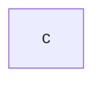
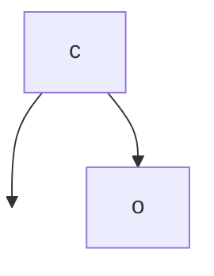
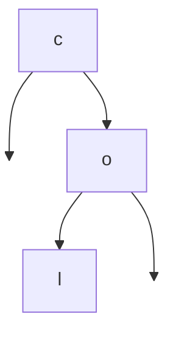
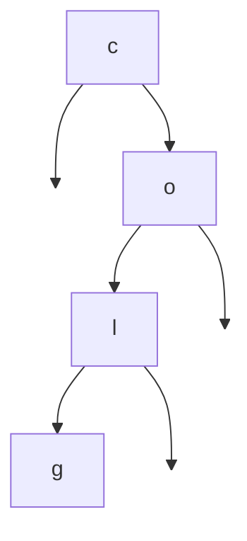
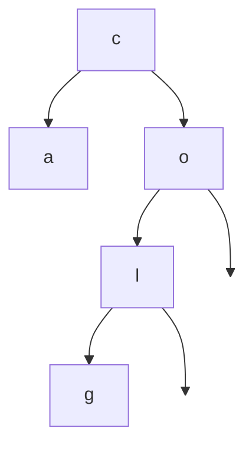
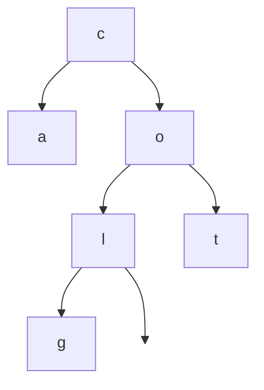
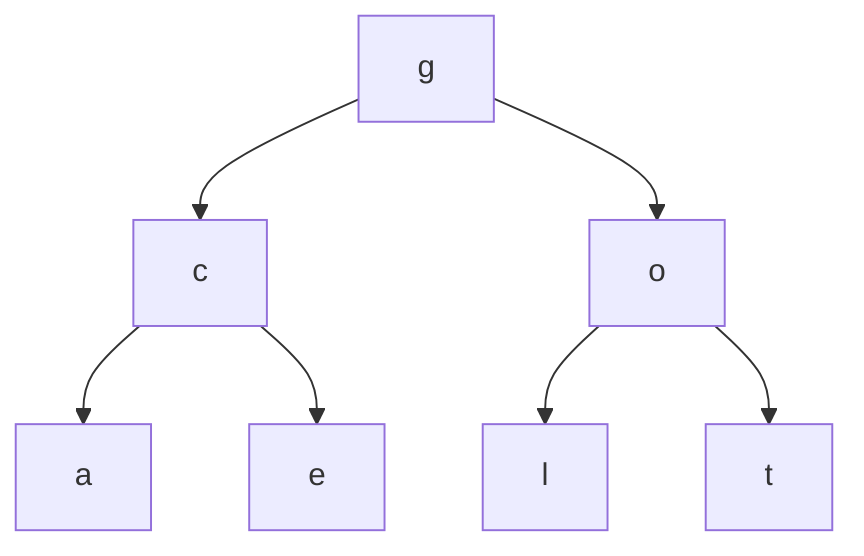
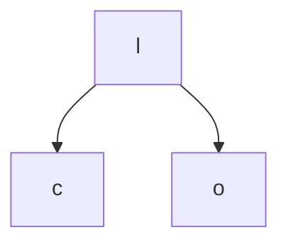

```mermaid
graph TD
 c --> a
 c --> o
 o --> l
 o --> t
 l --> g
 l --> i3(" "):::hidden
 g --> e
 g --> i4(" "):::hidden
 
 classDef blueFill fill:#122e6b;
 classDef hidden display:none;
 classDef redBorder stroke:#f21e02;
```

# Binary Search Trees
#algo/data-structures 
#algo/sorting 
#concept
**Related:**
-  [[02-25-2021 PSS Binary Search Trees]]
-  [[Tree]]

---

## Definition
: A [[Tree]] with certain properties that allow for a [[List]] implementation with a quick lookup time. Each node has at most two children and the placement of each node is ordered by one of its values relative to the values of every other node. This ordering allows for good lookup times if the tree is **well-balanced**

- Maintain the entire structure by a pointer to the center item (root)
- BST recursive ordering:
	- Smaller items are in left sub-tree, larger items are in the right sub-tree
		- This logic follows recursively through the tree 
- At every level (if the tree is balanced) the sub-tree has half of the collection

**Applications:**
- When you want both dynamic memory allocation and a good search time

**✏ Ex:** 
You want to keep a sorted [[List]]: 1, 3, 7, 9, 10, 11, 14
- If this is represented with an array, it's difficult to insert an item. You can find where to insert it using binary search, but it's harder to actually insert because you must shift everything over
- If it's in a linked list it's much easier to change the pointer values during insert, but determining the placement is $O(n)$ and you can't use binary search

You can get the best of both of these (dynamic, binary search) with a binary search tree

<br/>

## Runtime

|         | Search      | Insert                     |
| ------- | ----------- | -------------------------- |
| Runtime | $O(\log n)$ | $O(\log n)$                |
| Space   | $O(1)$      | Total size is about $O(n)$ |

> 📝 As mentioned in [[02-25-2021 PSS Binary Search Trees]] it can sometimes be really useful to keep a count of how many children each sub-tree has within the root node but this has a slight space/time cost ($O(1)$)
 
<br/>

## BST Insert
#### ✏ Ex: C O L G A T E
*Putting the first element in blindly will result in a sub-optimal tree*



---

---

---

---

---

---

 
<br/>

### BST Search
#### ✏ Ex: Target - G 


1. G > C, search right
2. G < O, search left
3.  G < L, search left
4.  G == G, return

 <br/>

#### ✏ Ex: Target - N
1. N > C, right
2. N < O, left
3. N > L, right which isn't there so return -1

 <br/>

### BST Recursion
#### ✏ Ex: Counting the nodes

```
count(root):
	if root == null:
		return 0
	else:
		return 1 + count(root.left) + count(root.right)
```

 <br/>

#### ✏ Ex: Counting the height 
```
height(root):
	if root is null:
		return 0
	else:
		return 1 + max(height(root.left), height(root.right))
```

 <br/>

### Self-balancing trees
#### ✏ Ex Balancing C O L G A T E:
Naive add:


Balanced:




- Height should be $\log \text{items}$
- Rebuilding trees is a lot of work, how do we do this dynamically?


Is not optimal, 



Is much better. This is called a rotation and can be done as you add to trees

<br/>

## Red-Black Trees
 : A strategy to maintain well-balanced binary search trees, the insert operation is modified to keep track of potential imbalances
 
Link colors:
- Red: indicate nodes that may be unbalanced (new nodes before balancing, nodes that might be made unbalanced because of rebalances)
	- Ex: if you have two red links that are on top of each other but not next to each other, this indicated that you might need a rotation 
- Black: indicate nodes that are balanced/that a rotation has taken place
	- Ex: if you add two nodes but they're balanced they can be changed to black
		- If that happens, change the color of the link above that section to red (indicates that the section has had changes and might need to be re-balanced)
![[Pasted image 20210223191636.png|600]]


[A very helpful site](http://btechsmartclass.com/data_structures/red-black-trees.html)
## Properties
-   **Property #1:** Red - Black Tree must be a Binary Search Tree.
-   **Property #2:** The ROOT node must be colored BLACK.
-   **Property #3:** The children of Red colored node must be colored BLACK. (There should not be two consecutive RED nodes).
-   **Property #4:** In all the paths of the tree, there should be same number of BLACK colored nodes.
-   **Property #5:** Every new node must be inserted with RED color.
-   **Property #6:** Every leaf (e.i. NULL node) must be colored BLACK.

<br/>

## Basic insertion algorithm 
1. If the tree is empty add the new node as a black root node and exit (Prop 2)
2. If the tree is not empty, insert the **newNode** as a red leaf node using the basic BST insertion process.
4. If the parent of **newNode** is black, exit.
5. If the parent of **newNode** is red, check the color of **newNode**'s uncle (sibling of parent of **newNode**).
6. If uncle is black or `NULL` then rotate so that those three nodes (**newNode**, **newNode** parent, **newNode** uncle, and **newNode** grandparent) are ordered correctly. Now the children should be red and the parent node is black. 
7.  If uncle is red, recolor parent and uncle to black.
8.  Repeat this process until properties are satisfied.