# DP Optimal BST Search Example

---

Class: #algo/dynamic-programming 
Week: #week/week-10
Tags: 
Related:
- [[Dynamic Programming]]

---

## Problem
Given $n$ input strings in sorted alphabetical order and their frequencies $f_1, f_2, ... f_n$ determine the [[Binary Search Tree]] of lowest cost, given by the total number of expected comparisons

Cost for each word: $\text{depth in the tree} * \text{frequency of word}$
- the cost for the tree is the sum over all words

**Ex: ✏**  

| Word  | Frequency |
| ----- | --------- |
| begin | 5%        |
| do    | 40%       |
| else  | 8%        |
| if    | 10%       |
| then  | 10%       |
| while | 23%       |
| end   | 4%        |

```mermaid
graph TD
 e["end"] --> do
 do --> begin
 do --> else
 e --> then
 then --> if
 then --> while
 
 classDef blueFill fill:#122e6b;
 classDef redBorder stroke:#f21e02;
 classDef greenBorder stroke:#02fc66;
 classDef hidden display:none;
```

cost for this tree: 
*Root takes one comparison at 4% chance, do and then with 10% and 40%... etc.*
$1(.04)+2(.4+.1)+3(.05+.08+.1+.23) = 2.42$

 

## [[Greedy Algorithms|Greedy]] Approach

| Word  | Frequency |
| ----- | --------- |
| begin | 5%        |
| do    | 40%       |
| else  | 8%        |
| if    | 10%       |
| then  | 10%       |
| while | 23%       |
| end   | 4%          |

```mermaid
graph TD
 do --> begin
 do --> while
 while --> if
 if --> else
 else --> h:::hidden
 else --> e["end"]
 if --> then
 
 classDef blueFill fill:#122e6b;
 classDef redBorder stroke:#f21e02;
 classDef greenBorder stroke:#02fc66;
 classDef hidden display:none;
```

This is not balanced but works better
- Won't work because placing one thing down might get rid of better options later one

 

### [[Dynamic Programming|Dynamic]] Recurrence Idea
If we choose an arbitrary word $i$ as the root, then:
- Left subtree contains words $1, ... i-1$
- Right subtree contains words $i + 1, ... n$ *because of alphabetical ordering*
	- Subtrees should also be organized optimally as their are each their own BST, which suggests a recurrence.
- If a word is at depth $d$ in a subtree, it's at depth $d+1$ in the parent tree

The optimal cost of a tree for words $1, ... n$ is the minimum cost choice of picking a word as a root, which in turn induces two subproblems for the left and right subtrees.

![[Pasted image 20210330210642.png]]

- minimum cost induced by picking $i$ as the root and the two subproblems 
*weird f thing compensates for the  extra level*

 

**Memoize:** $OPT(i, j)$ for all $1\le i \le j \le n$

**Base case:** one word, the root. 

Populate $OPT(k, k) = f_k$ 
For each word $k$ try two adjacent words: 
$OPT(k, k+1)$ = either:
- word $k$ **is** root, cost is $f_k + 2f_{k+1}$
- word $k$ is **not** root, cost is $f_{k+1} + 2f_k$

Then three, then four, etc. until you get to $OPT(1, n)$ which is the answer

#### RT
$O(n^3)$
- $O(n^2)$ subproblems which each requires $O(n)$ time to iterate through the words and choose which should be the root

