# Heap Sort
#algo/sorting 
#concept
**Related:**
-  [[Sorting Algorithms]]

---

## Process
- Create max heap $O(n)$
- One by one, remove max (leave off at the end of the heap), placing minimum at top place
	- In-place sort
- People don't really use this very often because it's tricky to implement

### Ex:

|     |     |     |     |     |     |     |     |
| --- | --- | --- | --- | --- | --- | --- | --- |
| 9   | 8   | 7   | 3   | 1   | 4   | 5   | 2   |

Notice that doing a series of removes will make everything come out in order
If you remove 9, put 2 where it was so you have 

|     |     |     |     |     |     |     | Not in heap |
| --- | --- | --- | --- | --- | --- | --- | ----------- |
| 2   | 8   | 7   | 3   | 1   | 4   | 5   | 9           |

```mermaid
graph TD
 2 --> 8
 8 --> 3
 8 --> 1
 2 --> 7
 7 --> 4
 7 --> 5
 
 classDef blueFill fill:#122e6b;
 classDef redBorder stroke:#f21e02;
 classDef greenBorder stroke:#02fc66;
```

Fix heap during remove

```mermaid
graph TD
 8:::redBorder --> 3:::redBorder
 3 --> 2:::redBorder
 3 --> 1
 8 --> 7
 7 --> 4
 7 --> 5
 
 classDef blueFill fill:#122e6b;
 classDef redBorder stroke:#f21e02;
 classDef greenBorder stroke:#02fc66;
```

Now you have 

|     |     |     |     |     |     |     | Not in heap |
| --- | --- | --- | --- | --- | --- | --- | ----------- |
| 8   | 3   | 7   | 2   | 1   | 4   | 5   | 9           |

Remove largest again and swap with last place

|     |     |     |     |     |     | -   | -   |
| --- | --- | --- | --- | --- | --- | --- | --- |
| 5   | 3   | 7   | 2   | 1   | 4   | 8   | 9   |

If you continue doing this, it will eventually be sorted. This is heap sort

 

## RT

| Time             | Space  |
| ---------------- | ------ |
| $O(n\log n)$ | $O(1)$ |

 

## RT Analysis:
- $n$ items, each remove is $O(\log n)$ so runtime is $O(n\log n)$
- In-place so constant space