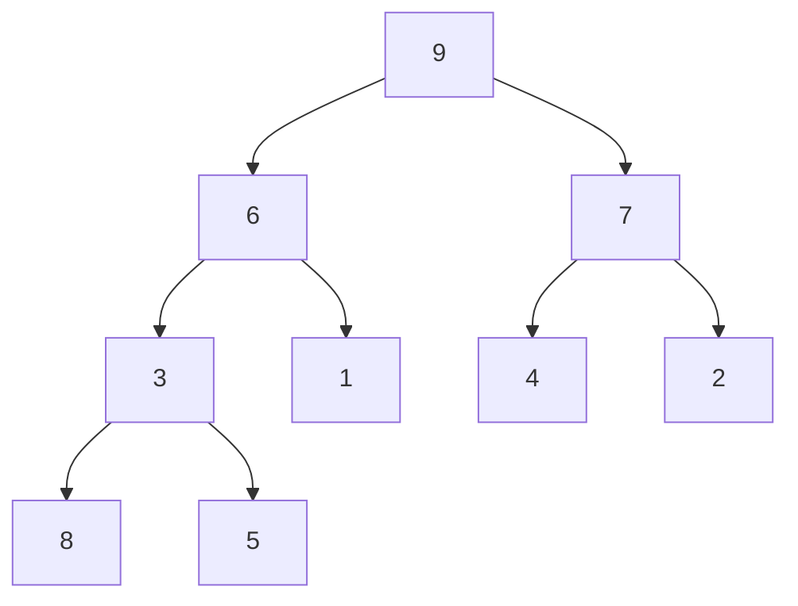

# Heaps
#algo/data-structures 
#concept
**Related:**
-  [[Data Structures]]
-  [[Priority Queue]]
-  [[Heap Sort]]
-  [[03-18-2021 Priority Queues PSS]]

---

## Definition
: A data structure which maintains the ordering used in a [[Priority Queue]], usually uses an array as the underlying structure.
- Change the structure of binary search goal to output in priority

- Visualize as a binary tree but implement as a list because of what is outlined in [[Heap#Understanding Tree Visualization and Array Implementation]]

**Properties**
- The item that will be removed next is always the root of the [[Tree]] (just used to visualize)
- Levels fill form left to right, a level must fill completely before adding a new one
	- Every tree of x items will structurally look the same
- In a max-oriented heap, nodes are larger than their children, children are smaller than their parents
	- Opposite for min-oriented
- **There is no ordering of children on the same level relative to each other**
- Height = $O(\log n)$

Ex:

```mermaid
graph TD
 15 --> 10
 10 --> 3
 10 --> 8
 15 --> 5
 5 --> 4
 5 --> id(" "):::hidden
 
 classDef blueFill fill:#122e6b;
 classDef redBorder stroke:#f21e02;
 classDef greenBorder stroke:#f21e02;
 classDef hidden display:none;
```

❕ If you add something here it must be below 5 (because must be filled from left to right)
- Highest priority is 15, easy lookup

## Runtime

| Operation |             |
| --------- | ----------- |
| Insert    | $O(\log n)$ |
| Remove    | $O(\log n)$ |
| Peek      | $O(1)$      |
| Creation  | $O(n)$      |

  

## Understanding Tree Visualization and Array Implementation
- Notice at a tree node's labeled position, 
	- the left child is 2 x the parent's index
	- the right child is the parent's index x 2 + 1

```mermaid
graph TD
 id1["15 (index 1)"] --> id2["10 (idx 2)"]
 id2 --> id3["6 (idx 4)"]
 id3 --> id4["3 (idx 8)"]
  id3 --> id9[" "]:::hidden
 id2 --> id5["8 (idx 5)"]
 id1 --> id6["5 (idx 3)"]
 id6 --> id7["4 (idx 6)"]
 id6 --> id8["7 (idx 7)"]
 
 classDef blueFill fill:#122e6b;
 classDef redBorder stroke:#f21e02;
 classDef greenBorder stroke:#f21e02;
 classDef hidden display:none;
```

The list representation is this: (size stored at index 0)

| 0 (size) | 1   | 2   | 3   | 4   | 5   | 6   | 7   | 8   |
| -------- | --- | --- | --- | --- | --- | --- | --- | --- |
| 8        | 15  | 10  | 5   | 6   | 8   | 4   | 7   | 3   |

**Ex:** Index 2's children: 2 x 2 == index 4 (priority 6), 2 x 2 + 1 == index 5 (priority 8)

> So the heap is basically a list where things are ordered this way. Individual swaps would take $O(1)$ time because you know indices using above method

 

## Heap Insert
### General process:
1. Create a node in the next available spot based on filling left to right property
2. Insert new item here
3. Bottom-up heap fix

### Ex 1:   
Insert priority 7
- Must be after 5

```mermaid
graph TD
 15 --> 10
 10 --> 3
 10 --> 8
 15 --> 5
 5 --> 4
 5 --> 7
 
 classDef blueFill fill:#122e6b;
 classDef redBorder stroke:#f21e02;
 classDef greenBorder stroke:#f21e02;
```

- Nothing under 7, so for children heap ordering is fine
- Is 7 < parent? ❌ heap ordering is violated
	- Swap 5 and 7

```mermaid
graph TD
 15 --> 10
 10 --> 3
 10 --> 8
 15 --> 7:::redBorder
 7 --> 4
 7 --> 5:::redBorder
 
 classDef blueFill fill:#122e6b;
 classDef redBorder stroke:#f21e02;
 classDef greenBorder stroke:#f21e02;
```

- **Don't** have to check 4 < 7 because previous parent (5) was bigger, so 7  > 5 => 7 > 4
- 7 < 15? ✔
	- Terminate when you find a parent that is larger bc the rest is already sorted

### Ex 2:   
Insert priority 6

```mermaid
graph TD
 15 --> 10
 10 --> 3
 3 --> 6:::greenBorder
 10 --> 8
 15 --> 7
 7 --> 4
 7 --> 5
 
 classDef blueFill fill:#122e6b;
 classDef redBorder stroke:#f21e02;
 classDef greenBorder stroke:#02fc66;
```
- 6 < 3? ❌, swap

```mermaid
graph TD
 15 --> 10
 10 --> 6:::redBorder
 6 --> 3:::redBorder
 10 --> 8
 15 --> 7
 7 --> 4
 7 --> 5
 
 classDef blueFill fill:#122e6b;
 classDef redBorder stroke:#f21e02;
 classDef greenBorder stroke:#02fc66;
```
- 6 < 10? ✔, done

### Ex 3:   
- Insert priority 18

```mermaid
graph TD
 15 --> 10
 10 --> 6
 6 --> 3
 6 --> 18:::greenBorder
 10 --> 8
 15 --> 5
 5 --> 4
 5 --> 7
 
 classDef blueFill fill:#122e6b;
 classDef redBorder stroke:#f21e02;
 classDef greenBorder stroke:#02fc66;
```
- 18 < 6? ❌, swap

```mermaid
graph TD
 15 --> 10
 10 --> 18:::redBorder
 18 --> 3
 18 --> 6:::redBorder
 10 --> 8
 15 --> 5
 5 --> 4
 5 --> 7
 
 classDef blueFill fill:#122e6b;
 classDef redBorder stroke:#f21e02;
 classDef greenBorder stroke:#02fc66;
```

- 18 < 10? ❌, swap

```mermaid
graph TD
 15 --> 18:::redBorder
 18 --> 10:::redBorder
 10 --> 3
 10 --> 6
 18 --> 8
 15 --> 5
 5 --> 4
 5 --> 7
 
 classDef blueFill fill:#122e6b;
 classDef redBorder stroke:#f21e02;
 classDef greenBorder stroke:#02fc66;
```

- 18 < 15? ❌, swap

```mermaid
graph TD
 18:::redBorder --> 15:::redBorder
 15 --> 10
 10 --> 3
 10 --> 6
 15 --> 8
 18 --> 5
 5 --> 4
 5 --> 7
 
 classDef blueFill fill:#122e6b;
 classDef redBorder stroke:#f21e02;
 classDef greenBorder stroke:#02fc66;
```
- At root, done

  

## Heap remove
Removing the root node, putting the last item in root position, top-down heap fix

### Process
1. Save item at the root to return
2. Remove node at the last position (level by level left to right)
3. Put value of removed node at root
4. Top-down heap-fix, swapping with larger child if child is larger

### Ex:

```mermaid
graph TD
 18 --> 15
 15 --> 10
 10 --> 3
 10 --> 6
 15 --> 8
 18 --> 5
 5 --> 4
 5 --> 7
 
 classDef blueFill fill:#122e6b;
 classDef redBorder stroke:#f21e02;
 classDef greenBorder stroke:#02fc66;
```

- Save 18 to return 
- Will be removing the **node** of 6 from the bottom to retain filling from left to right
- Remove 18, replace with 6

```mermaid
graph TD
 6:::redBorder --> 15
 15 --> 10
 10 --> 3
 15 --> 8
 6 --> 5
 5 --> 4
 5 --> 7
 
 classDef blueFill fill:#122e6b;
 classDef redBorder stroke:#f21e02;
 classDef greenBorder stroke:#02fc66;
```

- 6 < 15 & 6 < 7, 15 > 7 so swap 6 and 15

```mermaid
graph TD
 15:::redBorder --> 6:::redBorder
 6 --> 10
 10 --> 3
 6 --> 8
 15 --> 5
 5 --> 4
 5 --> 7
 
 classDef blueFill fill:#122e6b;
 classDef redBorder stroke:#f21e02;
 classDef greenBorder stroke:#02fc66;
```

- 6 < 10 & 6 < 8, 10 > 8 so swap 6 and 10

```mermaid
graph TD
 15 --> 10
 10:::redBorder --> 6:::redBorder
 6 --> 3
 10 --> 8
 15 --> 5
 5 --> 4
 5 --> 7
 
 classDef blueFill fill:#122e6b;
 classDef redBorder stroke:#f21e02;
 classDef greenBorder stroke:#02fc66;
```

- 6 > 3 ✔, terminate 

 

## Heap Creation
Blindly use the underlying list as the heap ordering and then apply a top-down fix

  

### Ex1: 
Turn this list into a heap:

|     |     |     |     |     |     |     |     |     |
| --- | --- | --- | --- | --- | --- | --- | --- | --- |
| 9   | 6   | 7   | 3   | 1   | 4   | 2   | 8   | 5   | 

```mermaid
graph TD
 9 --> 6
 6 --> 3
 3 --> 8
 3 --> 5
 6 --> 1
 9 --> 7
 7 --> 4
 7 --> 2
```
-> if you blindly put this list into a heap it just happened to work okay this time but you can't guarantee this this, need to do a top-down fix
- Just look at 3 8 5 section

```mermaid
graph TD
 9 --> 6
 6 --> 3
 3:::highlight --> 8:::highlight
 3 --> 5:::highlight
 6 --> 1
 9 --> 7
 7 --> 4
 7 --> 2
 classDef highlight fill:#122e6b;
 classDef swap1 stroke:#333;
```

Fix by swapping parent with larger child
-> Swap 3 and 8

```mermaid 
graph TD
 9 --> 6
 6 --> 8
 6 --> 1
 8:::redBorder --> 3:::redBorder
 8 --> 5
 9 --> 7
 7 --> 4
 7 --> 2
 
 classDef blueFill fill:#122e6b;
 classDef redBorder stroke:#f21e02;
 classDef greenBorder stroke:#f21e02;
 ```

8 > 6, swap 6 and 8
8 < 9 ✔

```mermaid
graph TD
 9 --> 8
 8:::redBorder --> 6
 8 --> 1
 6:::redBorder --> 3
 6 --> 5
 9 --> 7
 7 --> 4
 7 --> 2
 
 classDef blueFill fill:#122e6b;
 classDef redBorder stroke:#f21e02;
 classDef greenBorder stroke:#f21e02;
```

Check if the rest of the tree is okay 
- checking 6 3 5 section, that sub heap is okay
- Heap above that is okay
- Right sub-heap is okay
-> Whole sub-heap is okay

This sub-heap fix doesn't require looking at the whole tree ❓

 

## Ex 2

|     |     |     |     |     |     |     |     |
| --- | --- | --- | --- | --- | --- | --- | --- |
| 5   | 1   | 7   | 3   | 8   | 4   | 9   | 2   |  

```mermaid
graph TD
 5 --> 1
 1 --> 3
 3 --> 2
 1 --> 8
 5 --> 7
 7 --> 4
 7 --> 9
 
 classDef blueFill fill:#122e6b;
 classDef redBorder stroke:#f21e02;
 classDef greenBorder stroke:#02fc66;
```

- 3 2 ✔
- 1 3 8 ❌, swap 1 and 8
	- Left subheap done
-  7 4 9 ❌, swap 7 and 9
	-  Right subheap done

```mermaid
graph TD
 5 --> 8:::redBorder
 8 --> 3
 3 --> 2
 8 --> 1:::redBorder
 5 --> 9
 9 --> 4
 9:::greenBorder --> 7:::greenBorder
 
 classDef blueFill fill:#122e6b;
 classDef redBorder stroke:#f21e02;
 classDef greenBorder stroke:#02fc66;
```

- 5 8 9 ❌, swap 5 and 9
	- Need to check children of the one you just switched down

```mermaid
graph TD
 9:::redBorder --> 8
 8 --> 3
 3 --> 2
 8 --> 1
 9 --> 5:::redBorder
 5 --> 4
 5 --> 7
 
 classDef blueFill fill:#122e6b;
 classDef redBorder stroke:#f21e02;
 classDef greenBorder stroke:#02fc66;
```

- 5 4 7 ❌, swap 5 and 7

```mermaid
graph TD
 9--> 8
 8 --> 3
 3 --> 2
 8 --> 1
 9 --> 7:::redBorder
 7 --> 4
 7 --> 5:::redBorder
 
 classDef blueFill fill:#122e6b;
 classDef redBorder stroke:#f21e02;
 classDef greenBorder stroke:#02fc66;
```

  
