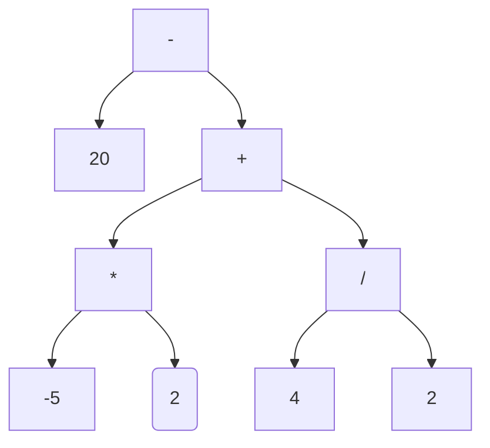

# Trees
#algo/data-structures 
#concept
**Related:**
- [[Binary Search Tree]]
-  [[02-25-2021 PSS Binary Search Trees]]

---

## Definition
[Interface Tree](https://docs.oracle.com/javase/9/docs/api/jdk/nashorn/api/tree/Tree.html)

: A collection of nodes which point to other nodes usually in a hierarchy
- A [[Graphs|Graph]] containing one path between any pair of nodes

**Terminology**
==Root:== top of tree
==Node:== other values
==Link:== connects nodes
==Parent node:== node above and connecting to a lower node
==Leaf:== no more nodes below
==Subtree:== tree within another tree
==Binary tree:== each node has at most two children

**Applications**
- Representing hierarchical things 
- For [[Binary Search Tree]]

### ✏ Ex: representing a math equation 
$20 - ((-5*2) + (4 / 2))$



```
Value(node):
	if node is a leaf:
		return node.content
	else:
		operator = node.contents
		left = value(node.left)
		right = value(node.right)
		return op(left, right)
```

 <br/>

## Implementations
[java.util.TreeSet\<E>](https://docs.oracle.com/javase/7/docs/api/java/util/TreeSet.html)
- These [[Set]] use trees as the underlying structure 
[java.util.TreeMap\<K, V>](https://docs.oracle.com/javase/7/docs/api/java/util/TreeMap.html) 
- These [[Map]] use trees as the underlying structure, I believe this is actually a [[Binary Search Tree]]

<br/>

## Traversals
> ✨ Remember 102 boat analogy of a boat that sails around the nodes of the tree from the left to right and visits each node form a certain direction depending on the type of traversal, all of these descriptions depend on it

 <br/>

#### Pre-order traversal
: Visiting each node from the **left** as you go along the tree (left nodes first) 

```
preorder(node):
	if node is not null: //empty sub tree
		action(node)
		preorder(node.left)
		preorder(node.right)	
```

 <br/>

#### Post-order Traversal
: Visiting each node from the **right** as you go along the tree (left nodes first)

```
postorder(node):
	if node is not null: //empty sub tree
		postorder(node.left)
		postorder(node.right)	
		action(node)
```

 <br/>

#### In-order Traversal
: Visiting each node from the **bottom** as you go along the tree (left nodes first)

```
inorder(node):
	if node is not null: //empty sub tree
		inorderorder(node.left)
		action(node)
		preorder(node.right)	
```