# Tries
#algo/data-structures 
#concept
**Related:**
-   [[03-04-2021 PSS Tries]] ⭐ This is extremely helpful

---

## Definition
: A type of search [[Tree]], usually used to store strings. Each node is a single character. Each node may point to any number of characters within the given alphabet, and traversing through the nodes and building up characters until you reach one that is marked as the end of a word is how you access the strings. 
- Space wise, it is better then storing many strings in a [[Binary Search Tree]]

**Applications**
- Storing dictionaries of words

```mermaid
graph TD
 o --> a
 o --> b
 o --> c...
 o --> ...z
 c... -->1(a)
 c... --> 2(b...)
 c... --> 3(...z)
 
 classDef blueFill fill:#122e6b;
 classDef redBorder stroke:#f21e02;
 classDef greenBorder stroke:#02fc66;
 classDef hidden display:none;
```



- Each letter/node has 26 options
- Pretty good space wise because things with the same prefix partially follow the same path
	ex: park, part
	In an ArrayList these full strings would have to be stored separately

```mermaid
graph TD
 p --> a
 a --> r
 r --> k
 r --> t

 classDef blueFill fill:#122e6b;
 classDef redBorder stroke:#f21e02;
 classDef greenBorder stroke:#02fc66;
```



### Nodes
Each node stores:
- Character value
- Boolean marker to shows if the word ending at that node is present/is a word
- Pointers to children
	- Could use[[Map#HashMap]]dices like in textbook
	- Could use a [[Map#HashMap]] (Shown in [[03-04-2021 PSS Tries]])

```Java

Class TrieNode {
	boolean m;
	HashMap<Character, TrieNode> map;
}
```

## Runtime

| Search                            | Insertion                         |
| --------------------------------- | --------------------------------- |
| $O(1 + \text{length of the key})$ | $O(1 + \text{length of the key})$ |

> ✨ This is pretty optimal for search, can't do much better than linear and determining if it's a search miss does not require checking every node in most cases

### Space
The number of links is between $RN$ and $RNw$ where $w$ is the average key length, $N$ is number of keys (words), and $R$ is the size of the alphabet

## Search
Follow the characters until you find the final character. 
- If the marker specifies that it is a word, if there is a value return it 
- If not or you don't find the node where you expect to (reach a null link instead) this is a search miss

[[03-04-2021 PSS Tries]] is extremely helpful for understanding navigation

 <br/>

## Insertion
Either:
- You reach a null link before reaching the last character of the key, so you will need to add new nodes for each character not encountered yet and set the value in the last one to the value associated with the key (present or not)
- You reach the last character before a null link so set the value in the node of the last character to be whatever is associated with the key (present or not)
