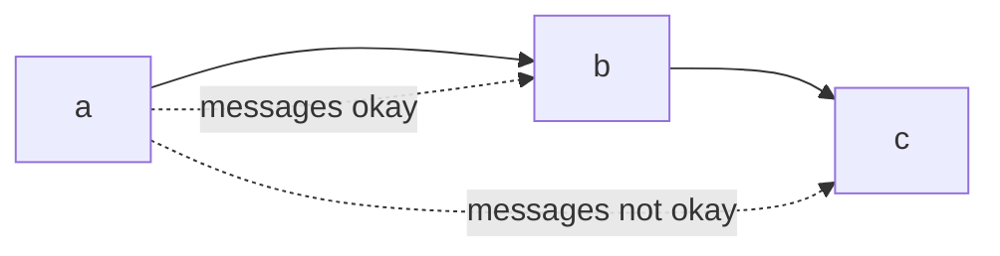

# Design Patterns
%%
#topic
#concept
%%
**Related:**
-  

---

#📌 Break these into different files

: Reusable structure, behavior, strategy, or technique that captures a proven solution to a collection of similar problems by separating the things that change form the things that stay the same
- Blueprint for a design

GoF (Gang of four design pattern) authors:
> - "Prefer composition and delegation over inheritance"
> - "Program to an interface, not an implementation"

==Antipattern:== Code that looks like it should follow a pattern but doesn't. Not DRY, needless repetition 


## SOLID Principles
**SOLID** OOP Design Patterns:
- **S:** [[Design Patterns#Single Responsibility Principle SRP|Single Responsibility Principle SRP]]
- **O:** [[Design Patterns#Open-Closed Principle OCP|Open-Closed Principle OCP]]
- **L:** [[Design Patterns#Liskou Substitution Principle|Liskou Substitution Principle]] 
- **I:** [[Design Patterns#Injection of Dependencies|Injection of Dependencies]]
- **D:** [[Design Patterns#Demeter Principle|Demeter Principle]]

### Single Responsibility Principle (SRP)
**Rule:** A class should have only one reason to change. Each responsibility is an axis of change, changes to one axis shouldn't affect others


**Design smells:**
- High LCOM score
- Models with many sets of behaviors, large class files
- **Ex: ✏**  In a [[Rails Models]], one user model might be a customer, auth principle, social network member, etc.
	- These should be converted to separate models with 1-1 relationships 
	- You woulnd't necessarily need to build a new controller for this model 
- Data clumps: vars "travel" together through methods, etc. 

#### LCOM (Lack of Cohesion Of Methods) score
Warns you if the class consists of multiple “clusters” in which methods within a cluster are related, but methods in one cluster aren’t strongly related to methods in other clusters.

$$\text{LCOM}_1 = 1 - \frac{\sum M(V_i)}{V*M}$$
$V$ = num instance vars
$M$ = # instance methods
$V_i$ = # instance variables used by a method (if the same 3 vars are used in 2 methods, 6)

- Should be between 0 and 1, if it's high it should be split into multiple methods

#### Address using:
- [[Design Patterns#🏘 Composition]]

###  Open-Closed Principle (OCP)
**Rule:** Code should be open for extension but not for source modification
**Design smells:** 
- Switch/case statements and run-time type identification
- Can’t extend (add new types) without changing base class

#### Address using:
- [[Design Patterns#🐣 Abstract Factory Pattern]]
- [[Design Patterns#🤹‍ Template Method Pattern]]
- [[Design Patterns#🏘 Decorator Pattern]]

### Liskou Substitution Principle
**Rule:** If $s$ is a subtype of $T$, the objects of type $T$ can be replaced by objects of type $s$. If this is not the case, then it is a violation.

"Substituting a subclass for a class should preserve correct program behavior"

- Not strictly about inheritance, if you can't ensure that all objects will respond the same way to an operation it is a violation
- If a depends on b but b's implementation can change, make an abstract interface that both rely on instead. Injecting dependencies 
	- **Ex: ✏**  If you use a specific service that you end up changing you'd have to rewrite all of the code that deals with the old API, instead you can write an interface for it (`AbstractMailAgent`), use that, and just change that

**Design smells:**
- Subclass destructively overrides an inherited method. (Refused bequest: not being able to call a method on a subclass in place of super class
- Forcing changes to the superclass to avoid the problem

#### Address using:
- Replace inheritance with delegation
- [[Design Patterns#🏘 Composition]]

### Injection of Dependencies 
**Rule:** Collaborating classes whose implementation may vary at runtime should depend on an intermediate “injected” dependency.

**Problem:** $a$ depends on $b$, but $b$’s interface & implementation can change, even if the functionality is generally stable.

**Ex: ✏**  Web App uses a MySQL database, but because of scaling and pricing issues, you want to migrate to using a PostgreSQL database

**Design smells:**
- Unit tests that require ad hoc stubbing to create seams
- Constructors that hardwire a call to another class’s constructor, rather than allowing runtime determination of which other class to use

#### Address using:
- Inject an abstract interface than $a$ and $b$ depend on 
- If not an exact match:
	- [[Design Patterns#🏘 Adapter Facade Bridge Proxy]]
	- [[Design Patterns#🤹‍ Null Object]]
	- Proxy


### Demeter Principle
**Rule:** Can call methods on yourself and your own instance variables but not the results returned by them. Object should not have details of the inner workings of another object it's manipulating.

Method can call other methods in its own class, and methods on the classes of its own instance variables; everything else is taboo.

**Pro:** Code is more manageable and adaptable 
**Con:** Usually uses a lot of abstraction + wrappers which can bloat classes

Friend/friend of a friend principle


**Design smells:**
- Inappropriate intimacy: Manipulating attributes of another class directly
- Feature envy: Repeated inappropriate intimacy,  when one class "wishes" it had the features of another
- Mock trainwrecks: testing code that violates Demeter, requires setting up a chain of mocks that will be used when we call the method under test

#### Address using:
- Replace method with delegate [[Design Patterns#🏘 Composition]]
- [[Design Patterns#🤹‍ Visitor]]
- [[Design Patterns#🤹‍ Observer Pub-sub]]

---

## Patterns 
### 🐣 Creation
#### 🐣 Abstract Factory Pattern 
==Def:== "Provide an interface for creating families of related or dependent objects  
without specifying their concrete classes". A common interface for instantiating an object whose subclass may not be known until runtime.

#### 🐣 Singleton
==Def:== "Ensure a class has only one instance, and provide a global point of access to it"

#### 🐣 Prototype
==Def:== "Specify the kinds of objects to create using a prototypical instance, and create new objects by copying this prototype."

---

### 🏘 Structure
#### 🏘 Composition
==Def:== "Provide operations that work on both an individual object and a collection of that type of object"

**Typical Implementation:**  Instead of inheritance, composition is a class that has a lot of other classes that are a part of it. The main class modifies the other classes. Access a group of objects uniformly. 

```Ruby
class Report
	attr_accessor :title. :text, :formatter
	def output_report
		@formatter.output_report
	end
end
```

#### 🏘 Decorator Pattern 
==Def:== "Attach additional responsibilities to an object dynamically, keeping the same interface. Helps with preferring composition or delegation over inheritance."

**Typical Implementation:** Subclass delegates original functionality and adds it's own. A wrapper around a class

**Ex: ✏**  [[Ruby Rails]] scopes
```Ruby
Movie.for_kids.with_good_reviews(3)
Move.has_many_fans.recently_viewed
```

#### 🏘 Adapter, Facade, Bridge, Proxy
==Def:== "Convert the programming interface of a class into another (sometimes simpler) interface that clients expect, or decouple an abstraction’s interface from its implementation, for dependency injection or performance"


##### 🏘 Adapter
==Def:== Decoupling an abstractions interface from its implementation
**Ex: ✏**  Database “adapters” for MySQL, Oracle, PostgreSQL, etc.

##### 🏘 Facade
*Variation of adapter*

==Def:== Unifying distinct underlying API’s into a single, simplified API
- **Con:** Can over-simplify so not usable or only make it work for one use-case

##### 🏘 Bridge
#❓
==Def:== Separating the abstraction and the implementation. So you can use several solutions for one problem
- **Con:** Can overdo it

##### 🏘 Proxy
*Variation of adapter*

==Def:== One object “stands in” for another that has the same API
Implements methods as "real" service objects but intercept each call

### 🤹‍ Behavior
#### 🤹‍ Template Method Pattern
*Supports the case in which there is a general approach to doing a task but  
many possible variants.*

==Def:== "Uniformly encapsulate multiple varying strategies for same task". **Set of steps** is the same, implementation of steps is different

**Typical implementation:** Inheritance, with sub-classes overriding abstract methods. Template method stays the same; helpers overridden in subclass

#### 🤹‍ Strategy Pattern
*Supports the case in which there is a general approach to doing a task but  
many possible variants.*

==Def:== "Uniformly encapsulate multiple varying strategies for same task". **Task** is the same, but many ways to do it
- Must be good default strategies

**Typical implementation:** Composition, separating different pieces of a problem into different classes/libraries

#### 🤹‍ Null Object
==Def:== "(Doesn’t appear in GoF catalog) Provide an object with defined neutral behaviors that can be safely called, to take the place of conditionals guarding method call". A dummy object that has all the same behaviors as a real object but doesn't do anything when those behaviors are called

**Ex: ✏**  All Customers should names, and we should be able to store certain important information about them. But what if we need to accommodate anonymous or guest users? Null object allows us to avoid scattered conditional (if) blocks

#### 🤹‍ Observer (Pub-sub)
==Def:== One or more entities need to be notified when something happens to an object.

Provides a canonical way for the subject to maintain a list of its observers and notify them automatically of any state changes in which they have indicated interest, using a narrow interface to separate the concept of observation from the specifics of what each observer does with the information.

**Problem:** entity $O$ (“observer”) wants to know when certain things happen to entity $S$ (“subject”)
- **Ex: ✏**  Auditor wants to know whenever “sensitive” actions are performed by an admin

**Concerns:**
- Acting on events is $O$’s concern—don’t want to pollute $S$
- Any type of object could be an observer or subject—inheritance is awkward

**Con:** Can go overboard, get into event loops

#### 🤹‍ Visitor
==Def:== a data structure is traversed and you provide a callback method to execute for each member of the data structure, allowing you to “visit” each element while remaining ignorant of the way the data structure is organized.

##### 🤹‍ Iterator
*Visitor pattern subtype*

==Def:== "Separate traversal of a data structure from operations performed on each element of the data structure"


---


Needs more info: 

## Client-Server
- Distinguishing clients from the server, allowing each type of program to be highly specialized
- Client: asks questions on behalf of users
- Server: wait and respond to questions, serve many clients


![[Model-View-Controller (MVC)]]

![[Active Record]]

## Peer-to-peer Architecture
- 🌎 Used in BitTorrent
- Every participant is both a client and participant


