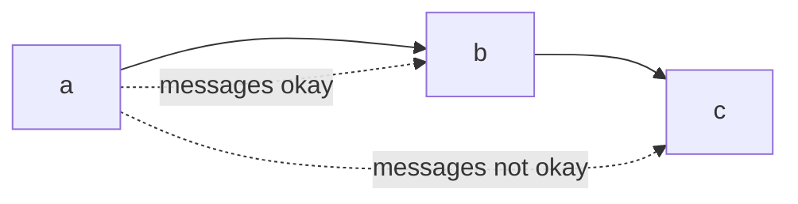

# Design Patterns
%%
#topic
#concept
%%
**Related:**
-  

---

#📌 Break these into different files

: Reusable structure, behavior, strategy, or technique that captures a proven solution to a collection of similar problems by separating the things that change form the things that stay the same
- Blueprint for a design

==Antipattern:== Code that looks like it should follow a pattern but doesn't. Not DRY, needless repetition 


## SOLID Principles
**SOLID** OOP Design Patterns:
- **S:** [[Design Patterns#Single responsibility principle SRP]]
- **O:** [[Design Patterns#Open-closed principle OCP|Open-closed principle (OCP)]]
- **L:** Liskou substitution principle 
- **I:** Injection of dependencies
- **D:** Demeter principle

### Single responsibility principle (SRP)
Rule: A class should have only one reason to change
- Each responsibility is an axis of change, changes to one axis shouldn't affect others
- **Ex: ✏**  In a [[Rails Models]], one user model might be a customer, auth principle, social network member, etc.
	- These should be converted to separate models with 1-1 relationships 
	- You woulnd't necessarily need to build a new controller for this model 

Lack of cohesion of methods: LCOM score
$$\text{LCOM}_1 = 1 - \frac{\sum M(V_i)}{V*M}$$
$V$ = num instance vars
$M$ = # instance methods
$V_i$ = # instance variables used by a method (if the same 3 vars are used in 2 methods, 6)

- Should be between 0 and 1, if it's high it should be split into multiple methods

###  Open-closed principle (OCP)
Code should be open for extension but not for source modification

#### Abstract Factory Pattern 
DRYing out construction in cases where you don't know the type beforehand??

#### Template Method Pattern
- Set of steps is the same, implementation of steps is different

#### Strategy Pattern
Task is the same, but many ways to do it

```Ruby
class Report
	attr_accessor :title. :text, :formatter
	def output_report
		@formatter.output_report
	end
end
```

#### Decorator Pattern
- Solving with just inheritance can get complicated
Decorator: subclass delegates original functionality and adds it's own

**Ex: ✏**  [[Ruby Rails]] scopes
```Ruby
Movie.for_kids.with_good_reviews(3)
Move.has_many_fans.recently_viewed
```

### Liskou substitution principle
Rule: If s is a subtype of T, the objects of type T can be replaced by objects of type S. 
If this is not the case, then it is a violation

- Not strictly about inheritance, if you can't ensure that all objects will respond the same way to an operation it is a violation
- If a depends on b but b's implementation can change, make an abstract interface that both rely on instead. Injecting dependencies 
	- **Ex: ✏**  If you use a specific service that you end up changing you'd have to rewrite all of the code that deals with the old API, instead you can write an interface for it (`AbstractMailAgent`), use that, and just change that

#### Adapter / Facade
#### Null Object
#### Proxy Pattern
Implements methods as "real" service objects but intercept each call

### Demeter Principle 
Can call methods on yourself and your own instance variables but not the results returned by them. Object should not have details of the inner workings of another object it's manipulating

**+:** Code is more manageable and adptable 
**-:** Usually uses a lot of abstraction which can bloat classes

Friend/friend of a friend principle


## Singleton
- Can only be one instance of a class that anyone can access

## Facade
- Hiding the details behind a nice interface. Isn't this the same as abstraction?
- Con: Can over-simplify so not usable or only make it work for one use-case

## Bridge
- Separating the abstraction and the implementation. So you can use several solutions for one problem
- Con: Can overdo it

## Strategy
- Separating different pieces of a problem into different libraries
- Must be good default strategies

## Observer (Pub-sub)
- Allows for loose coupling between publisher (creates events) and subscriber (listens for events)
- Con: Can go overboard, get into event loops

## Client-Server
- Distinguishing clients from the server, allowing each type of program to be highly specialized
- Client: asks questions on behalf of users
- Server: wait and respond to questions, serve many clients


![[Model-View-Controller (MVC)]]

![[Active Record]]

## Peer-to-peer Architecture
- 🌎 Used in BitTorrent
- Every participant is both a client and participant


