# Design in HCI
#📥 
%%
#HCI
#concept

**Related:**
-  

%%

## What is design?

- activity of designing
- design process
- the results of the design process

 | Art                     | Design                              |
 | ----------------------- | ----------------------------------- |
 | No boundaries on intent | Always has a specific purpose, goal |
 | No clients necessarily  | Clients                             |

==Stakeholders:== Anyone who is impacted by the endeavor you're engaged with
- How do you create a solution within a space that considers as many stakeholders as possible?

## Wicked problems
Social or cultural problem that is difficult or impossible to solve, may not be able to please all stakeholders, conflict between other stakeholders, interconnected with different problems 

May meet some of these criteria:

1. No definitive formation
2. Impossible to measure or claim success
3. No idealized end-state
4. No template to follow 
5. Generally more than one explanation
6. Every wicked problem is a symptom of another wicked problem
7. No definitive test
8. All unique
9. Designers must be fully responsible for their actions

Non-example:
- Hard math problems

**Ex: ✏**  
- Global pandemic 
- Climate change
- Voter inequality 
- Gerrymandering 
- Tensions with Russia 

### Abductive Reasoning
: Trying to find the best possible answer given the circumstances
- Not concerned with right or correct answer
- Does not result in certainty 
- Result in progress

### Design frameworks
: Ways of navigating the complex task of design
- Where are we now
- What should we do next

> "Process is the net that allows you to leap" - Hartson & Pyla

#### Human-Centered Design
Puts human needs, capabilities, and behavior first, and then designing to accommodate those needs, capabilities, ways of behaving

Ensure that the designs match the needs of the people for whom they are intended

## Human-centered design

## Three levels of processing:

```mermaid
graph BT
 Behavioral --> Reflective
 Visceral --> Behavioral
 
 classDef blueFill fill:#122e6b;
 classDef redBorder stroke:#f21e02;
 classDef greenBorder stroke:#02fc66;
 classDef hidden display:none;
```

Good design addressed all three levels at once

### 🦎 Visceral
> "Design for the way people are, not for the way you want them to be"

- Reptile brain processing 
- Good/bad, safe/dangerous
- Fast, subconscious
- Immediate perception, all about attraction or repulsion 
- Not about usability
- Should leverage visceral responses

### 🐒 Behavioral 
- Learned skills, pattern and schema matching
- Largely unconscious, but **associated with expectations**
- Meeting expectations -> satisfaction and relief
- Failing to met them -> disappointment and frustration
- Feelings of control

### 🧠 Reflective
- Deep understanding is developed 
- Reflection happens after you've had the interaction

