# Model-View-Controller (MVC)
%%
#coding 
#concept
%%
**Related:**
-  [[Design Patterns]]
-  [[Rails Views]]
-  [[Rails Models]]

---

## Definition
- Goal: Separate organization of data (model) from UI and presentation (view) by introducing a controller
	- [[Rails Routing|URI routes]] maps action to model 
- Way to organize the server application in Client-Server Architecture
- [[Ruby Rails]] supports MVC

### Components
==Models:== [[Rails Models]] Store data about one entity
- Business logic work goes here
- Inherit form `ActiveRecord`
- Database interface, call abstracted CRUDI methods instead of database SQL calls
- Controller may call model methods

==Controllers:== [[Rails Controllers]] Mediate user actions requesting access to data
- Mediator between view and model
- Requests come from view in the form of [[Networks|HTTP routes]]
	- Routes (in config [[Rails Routing]]) determine which code should be invoked to handle that route
- Expose data to the views through `@variables`
- Receive data from views in `params, session, flash`
- Should either result in something being rendered or redirect to another view (often done with `create`)

==Views:== [[Rails Views]]Display data from models which has been manipulated by controllers on a webpage
- Renders data
- Pass data to controller using `params, session, flash`
- Access data from a controller method through `@variables`
- Calls URI helpers which help map to the route to call the correct controller method
- A lot of code should really not go here... If you a need it, you can write it in  `app/helpers` and call that method from the view

```mermaid
graph TD
 c("Controller: Mediate data between views and model") --> m("Model: DB interface")
 m -- Contoller pulls data from model through model methods --> c
 m -- Changes DB data through ActiveRecord methods --> db("Database")
 db -- Accesses DB data through ActiveRecord methods --> m
 c -- "Exposes model data through @vars" --> v("View: What is rendered")
 v -- Accesses controller methods through routes and passes data back from params, session, flash--> c
 r("Routes") -- Map to controller methods --> c
 h("Helper: Handles code from controller") -- returns --> v
 v -- data is passed as method args --> h
 
 classDef blueFill fill:#122e6b;
 classDef redBorder stroke:#f21e02;
 classDef greenBorder stroke:#02fc66;
 classDef hidden display:none;
```

## Where errors may happen
1. Route match (400 errors)
	- if fail, 404/ 400 error
	- if success, invoke controller method
2. Controller (500 errors),
	-  you could explicitly throw a 400 error but it doesn't really make sense
3. Model errors
4.  View errors

If there is like an input error with `permit` etc. this is still considered 200 bc on the [[Networks]] side of things it's okay, something you need to deal with as client