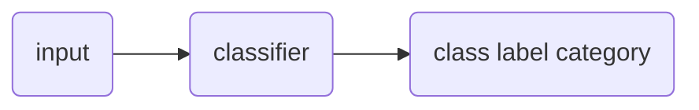

# Text Classification
#📥 
%%
#NLP 
#concept
%%
**Related:**
-  [[Naive Bayes' Classifiers]]

---

==Text Categorization:== Assigning a label or category to an entire text or document
==Sentiment Analysis:== Extraction of sentiment from text

[[Naive Bayes' Classifiers]] was created for subject category classification
Most classification is done using [[Machine Learning#Supervised Learning]]

**Process:**

- Inputs are texts
- Classes are known ahead of time
- If input is not in the correct dimension (vector), must reformat it (function `m`)

## Creating Text-to-Vector Function m
==Bag of Word Model:== id : token -> N
- [[Map|Dict]] to map IDs to a unique token (Like two dicts, keys to values and values to keys)

### Algorithm
1. Each token is assigned a value that is the current size of the dict

$d$ (unique tokens) corresponds to $max_x id(x)$

function delta returns 1 if $i \in id(x) | x \in tokens(text)$, 0 otherwise 
*index\[ID of this token in array] = 1*
m(text) = delta_0(text), delta_1(text)... delta_d-1(text)
**Creates a boolean mask of all of the tokens**

|     |     |     |     |
| --- | --- | --- | --- |
| 0   | 0   | 1   | 0   |

## Naive Bayes with Bag of Word
[[Naive Bayes' Classifiers]]
