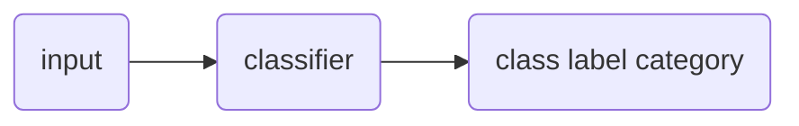

# Text Classification
#📥 
%%
#NLP 
#concept
%%
**Related:**
-  [[Bayes' Rule]]
-  [[Supervised Learning]]

---

==Text Categorization:== Assigning a label or category to an entire text or document
==Sentiment Analysis:== Extraction of sentiment from text

Naive Bayes' Classifiers were created for subject category classification
Most classification is done using [[Supervised Learning]] (this would be good to review)

**Process:**


- Inputs are texts
- Classes are known ahead of time
- If input is not in the correct dimension (vector), must reformat it (function `m`)

## **Ex: ✏**  Putting different types of irises into a data set
They used dimensions of particular parts of the flowers 
$m(\text{flower}) -> R^d$
- $R$ is a $d$ dimensional vector (like arrays, 2d arrays, 3d), see representation in [[Supervised Learning]]
	

### Creating Text-to-Vector Function m
If input data is not formatted correctly in a vector, must put into the right format using $m$

==Bag of Word Model:== Map $id : token -> N$
- [[Map|Dict]] to map IDs to a unique token (Like two dicts, keys to values and values to keys)

#### Algorithm
1. Each token is assigned a value that is the current size of the dict

$d$ (unique tokens) corresponds to $max_x id(x)$

$$
\text{function } \delta = \begin{cases}
1 &\text{if } i \in \text{id}(x) | x \in \text{tokens}(\text{text}) \\
0 &\text{otherwise}
\end{cases}
$$

Have a set of pairs, $X = {(x_1, y_1)...}$ that shows the classification? #NLP/❓
- Where $x \in R^D$ and 
- $y \in {c_1, ... c_k}$ (for classification, where each $c$ is one of the pre-defined classes)

*index\[ID of this token in array] = 1*
$m(\text{text}) = \delta_0(\text{text}), \delta_1(\text{text})... \delta_d-1(\text{text})$

**Creates a boolean mask of all of the tokens, if **


|     |     |     |     |
| --- | --- | --- | --- |
| 0   | 0   | 1   | 0   |

## Naive Bayes with Bag of Word

==Precision:== The percentage of items that the system detected that are in fact positive 
==Recall:== The percentage of items actually present in the input that were correctly identified by the system 

## Coding Implementation
Iris example: 
- Classes: Kinds of Irises
- Variables: Features of each: length, width... etc. 

```Python

from sklean.naive_bayes import GaussianNB

naive = GaussianNB()
naive.fit(D, y)

naive.class_prior_ # Shows info about the classes (kinds of irises)
naive.sigma_

```

Obtaining u from D
In numpy you can use a boolean array to get certain elements from an array


```Python

# Array masking
mask = np.array([True, False, True, False])
a = np.array([1, 2, 3, 4])
a[mask] => array([1, 3])

a == 2 => Array([False True False False])

# Adds them all up
a.sum()

```

Obtaining the standard deviation (o thing symbol raised to the power of two)

Think about having three classes as $D_0, D_1, D_2$

```Python

D0 = D[y == 0]
d0.shape

```

If you have a matrix and you want to add up columns, have to specify which axis you're working on
- Axis 0 is vertical/y
- Axis 1 is horizontal/x

So if we have something of shape (50, 4), Axis 0 is 50 numbers, axis 1 is 4

### Prediction 
Now that we have a model, we can use it for prediction to determine which class it is in
- `predict` expects a matrix

```Python

# Means it belongs to class 0, one kind of flower
x = np.array([5.4, 2.1, 2.3, 4.4]) # shape is (1, 4)
naive.predict([x]) # expects a metrix so make x (1d array) into a matric by putting it in backets

```

### Performance
We can use D to test the performance of the model
Very important 
Outputs will be in arrays, each element is for one class

$f$ is the trained model, the $\hat y = f(X)$, which corresponds to the predicted classes

True is in $y$, predicted is in $hy$

```Python

hy = naive.predict(D)

```

📝 It is not a good idea to test the model on the data used to train it because they will get it right even though it hasn't learned the model

$h(x) = y if x \in D, 0$ 
Need to split D into $X \in D$ and $T \in D$ where X intersection T is an empty set

```Python

index = np.arrange(D.shape([0])) # => Creates range object of a certain dimension?
# Shuffle index
index[:10], index[10:20]


```
