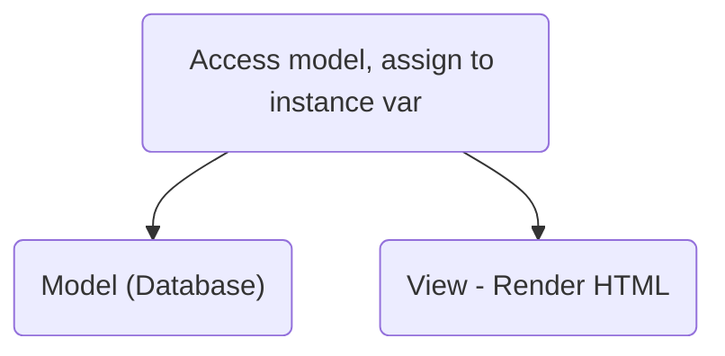

# Ruby Rails
#📥 *Really needs to be reogranized*
%%
#coding 
#concept
%%
**Related:**
-  [[Ruby]]
-  [[SaaS (Software as a Service)]]
-  [[Relational Databases]]

---

## Philosophy
- **Convention over Configuration**
	- If naming follow certain conventions, no need for config files
- **Don't Repeat Yourself (DRY)**
- **Sharp Knives are Provided**
	- Introspection and metaprogramming
	- Blocks (closures)
	- Modules (Mix-ins)

## Structure / Design Pattern
- Uses [[Design Patterns#Model-View-Controller MVC]]
	- Each Rails model is a resource type whose instances are rows in a particular table of a relational database 
	- Rails routing subsystem maps HTTP routes to code in the app that performs the correct action


## Making an App
- A class that descends from `ActiveRecord::Base` provides methods needed to connect model to the database
- `$ exec rails g(enerate) model`
	- Default table is model name in all lowercase with an s added at the end
		- Model `Book` -> BD table `books`
		- `TimeSheet` -> `time_sheet`
	- Lets you do everything except create the table, to do that you must create a ==migration:== a [[Ruby]] script describing a set of changes to make to the database schema
		- Do this instead of using SQL because Rails defines production environments, you'd have to make three identical SQL calls 
		- `$ exec rails g(enerate) migration [migration name]`
		- To add to the table, have to add to the seed

### In-class
- New creates git repo, gem file
- Can

```Bash
$ gem install rails
$ rails new

Can help initally to --skip-tests --skip-javascript --skip-bundle
```

- In gem files, dependencies and their versions are lsited
- Separate groups for each env
	- Ex: in `:development, :test`, may include rspec

```Bash
$ bundle config --without production
Installs gems in every env aside from production

$ rails server launches the sesrver
launches in localhost:3000
```

- Server usually live-updates, if you change routes or server configurations you must relaunch the server 




### Routing
guides.rubyonrails.org/routing.html

1. Routes: Map incoming URLs to controller actions and extract optional parameters 
	- Result of matching a route is calling an instance method in a controller class
	- Wildcard parameters: (e.g. `:id`) + query params are put into `params[]` hash and are accessible in controller actions 
2. Controller actions/methods: Set instance variables which are visible to views 
	- Controller methods call model's class methods ([[Ruby Rails#SQL Calls in Rails]] and any other additional methods) to retrieve database/model objects
	- Sub-directories of `views/` match controller and action names
	```Ruby
	# The controller
	class BooksController < ApplicationController
		def index
			# Unfinished
	```
	
3. Controller eventually renders a view 
	- Use `<% ... %>` to execute arbitrary lines of Ruby with no output
	- Use `<%= %>` for interpolating Ruby into HTML
	```HTML
	<!-- The view is what is actually rendered -->
	<tbody>
		<% @books.each do |book}| %>
			<tr>
				<td><%= book.title %> <!-- Ruby -->
				...
	```


### Models
- Business logic 
- Each model gets its own [[Relational Databases|Relational Database]] table
- 1 row = 1 model instance
- Each row has a unique primary key
	- By convention, and integer called `id`

==Schema:== Collection of their tables and their structure 

 [[Design Patterns#Active Record]] 
 
Types:
- int, string, text, decimal (digits, ), blob (raw binary)
- Can't have array 
 
 **Ex: ✏ Model for a product and user**  
 Model for a product:
 - `int` ID
 - `int` Quantity
 - `string` Image URL
 - `string` Name
 - `decimal` Price
 - `text` Description
 - `string` Manufacturer, maybe in another model
 - `string` Category/tags - probably in another model
 - Reviews - probably in another model

Model for a user:
- `int` ID
- `string` Username
- `string` Password
- `string` Name
- `string` Address - could be another model association or break it out here
- Payment info - in another model
- Cart IDs - another model
- Order history

## [[SQL]] Calls in Rails
Rails generally shields us from needing to make actual SQL calls

[[Networks#Representational State Transfer REST|CRUDI]]
- **SELECT** `[Model].all`
- **SELECT WHERE** `[Model].where("year >= 2000")`
	- Can be chained, like
		- `[Model].where("year >= 2000").where("year <= 2020")`
- **Create/INSERT** `Model.create(attribute: "The Perks of being a Wallflower", year: 1999)
	- If you don't specify attributes, default to `nil`/`null` (for databases)
- **Update/Read** `Model.find(9)` Takes ID
	- So save in the table, save the found object with `item.save!`
- **Delete** `item.destroy`